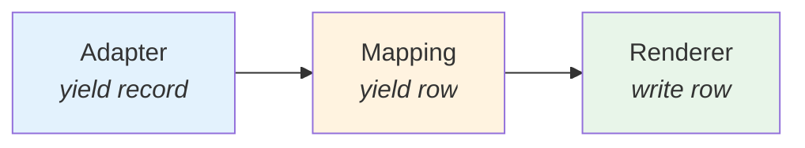

# Performance

**pyreps** is designed for high performance and low memory consumption.

## Streaming Pipeline

The entire pipeline is **lazy** — data flows record by record without accumulating in memory:



Each component is a Python **generator**. Data enters, is processed, and leaves — with no intermediate lists.

## Benchmarks

Results with 6 columns, declarative types enabled:

| Format | Records | Time | Peak RAM | File | rows/s |
|---------|-----------|-------|----------|---------|--------|
| CSV | 1K | 0.03s | **0.16 MB** | 0.06 MB | 33K |
| CSV | 10K | 0.30s | **0.16 MB** | 0.63 MB | 33K |
| CSV | 100K | 3.03s | **0.16 MB** | 6.67 MB | 33K |
| CSV | 500K | 15.2s | **0.16 MB** | 34.9 MB | 33K |
| XLSX | 1K | 0.05s | **0.59 MB** | 0.04 MB | 19K |
| XLSX | 10K | 0.46s | **0.62 MB** | 0.34 MB | 22K |
| XLSX | 100K | 4.75s | **0.62 MB** | 3.25 MB | 21K |
| XLSX | 500K | 23.9s | **0.62 MB** | 16.0 MB | 21K |
| PDF | 1K | 6.0s | 16.2 MB | 0.11 MB | 165 |
| PDF | 10K | 151s | 158 MB | 1.06 MB | 65 |

!!! success "Constant Memory (CSV/XLSX)"
    CSV and XLSX maintain **< 1 MB** of Python RAM regardless of the data volume.

!!! info "PDF: Memory O(chunk_size)"
    The PDF uses streaming by 200-row chunks (configurable). Peak RAM is proportional to `chunk_size × n_columns`, not to the total records. See [Formats → PDF](formats.md#pdf) for details.

## Performance Stack

| Component | Library | Language | Why |
|-----------|-----|-----------|---------|
| JSON parsing | `orjson` | **Rust** | ~6x faster than `json` stdlib |
| XLSX writing | `rustpy-xlsxwriter` | **Rust** | Native writing, accepts generators |
| XLSX widths | ZIP streaming | **Python** | Patching in 64KB chunks, no DOM |
| CSV | `csv` stdlib | **C** | Native module, as fast as possible |
| PDF | `reportlab` | **Python + C** | C core, industry standard |

## Optimization Tips

### Use generators as data source

```python
# ❌ Materializes everything before starting
data = [row for row in fetch_all_rows()]
generate_report(data_source=data, ...)

# ✅ Streaming — constant memory
def stream():
    for page in paginate():
        yield from page
generate_report(data_source=stream(), ...)
```

### Prefer CSV/XLSX for large volumes

PDF processes data in 200-row chunks (configurable via `metadata["pdf"]["chunk_size"]`), keeping memory proportional to the chunk size — not to the total records. Even so, the speed (~165 rows/s) is much lower than CSV/XLSX. For datasets above 50K rows, prefer CSV or XLSX.

### XLSX — `manual` mode for maximum speed

The `auto`/`mixed` mode calculates widths during streaming (minimal overhead). If you don't need automatic width:

```python
metadata={"xlsx": {"width_mode": "manual", "default_width": 15.0}}
```

## Reproducing Benchmarks

```bash
uv run python benchmarks/bench_performance.py
```
