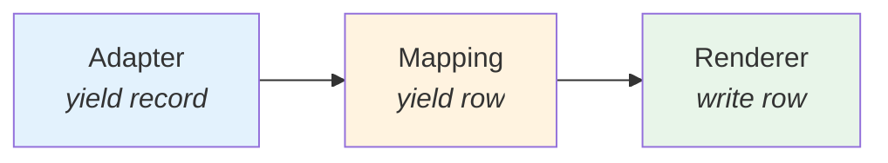

# Performance

O **py-reports** foi projetado para alta performance e baixo consumo de memória.

## Pipeline Streaming

Todo o pipeline é **lazy** — dados fluem registro a registro sem acumular em memória:



Cada componente é um **generator** Python. O dado entra, é processado e sai — sem listas intermediárias.

## Benchmarks

Resultados com 6 colunas, tipos declarativos habilitados:

| Formato | Registros | Tempo | Peak RAM | Arquivo | rows/s |
|---------|-----------|-------|----------|---------|--------|
| CSV | 1K | 0.03s | **0.16 MB** | 0.06 MB | 33K |
| CSV | 10K | 0.30s | **0.16 MB** | 0.63 MB | 33K |
| CSV | 100K | 3.03s | **0.16 MB** | 6.67 MB | 33K |
| CSV | 500K | 15.2s | **0.16 MB** | 34.9 MB | 33K |
| XLSX | 1K | 0.05s | **0.59 MB** | 0.04 MB | 19K |
| XLSX | 10K | 0.46s | **0.62 MB** | 0.34 MB | 22K |
| XLSX | 100K | 4.75s | **0.62 MB** | 3.25 MB | 21K |
| XLSX | 500K | 23.9s | **0.62 MB** | 16.0 MB | 21K |
| PDF | 1K | 6.0s | 16.2 MB | 0.11 MB | 165 |
| PDF | 10K | 151s | 158 MB | 1.06 MB | 65 |

!!! success "Memória constante"
    CSV e XLSX mantêm **< 1 MB** de RAM Python independente do volume de dados.

## Stack de Performance

| Componente | Lib | Linguagem | Por quê |
|-----------|-----|-----------|---------|
| JSON parsing | `orjson` | **Rust** | ~6x mais rápido que `json` stdlib |
| XLSX escrita | `rustpy-xlsxwriter` | **Rust** | Escrita nativa, aceita generators |
| XLSX widths | ZIP streaming | **Python** | Patch em chunks de 64KB, sem DOM |
| CSV | `csv` stdlib | **C** | Módulo nativo, o mais rápido possível |
| PDF | `reportlab` | **Python + C** | Core em C, padrão da indústria |

## Dicas de Otimização

### Use generators como data source

```python
# ❌ Materializa tudo antes de começar
data = [row for row in fetch_all_rows()]
generate_report(data_source=data, ...)

# ✅ Streaming — memória constante
def stream():
    for page in paginate():
        yield from page
generate_report(data_source=stream(), ...)
```

### Prefira CSV/XLSX para grandes volumes

PDF materializa todos os dados para calcular o layout da tabela. Para datasets acima de 50K linhas, use CSV ou XLSX.

### XLSX — modo `manual` para máxima velocidade

O modo `auto`/`mixed` calcula larguras durante o streaming (overhead mínimo). Se não precisar de largura automática:

```python
metadata={"xlsx": {"width_mode": "manual", "default_width": 15.0}}
```

## Reproduzindo os Benchmarks

```bash
uv run python benchmarks/bench_performance.py
```
