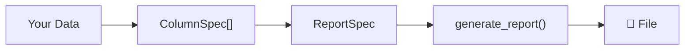

# Quickstart

## Installation

=== "pip"

    ```bash
    pip install pyreps
    ```

=== "uv"

    ```bash
    uv add pyreps
    ```

=== "poetry"

    ```bash
    poetry add pyreps
    ```

## Core Concepts

**pyreps** works in 3 steps:

1. **Define columns** with `ColumnSpec` — what to extract and how to format.
2. **Create the spec** with `ReportSpec` — output format and metadata.
3. **Generate** with `generate_report` — pass the data and the destination.



## Generating a CSV

```python
from pyreps import ColumnSpec, ReportSpec, generate_report

data = [
    {"id": 1, "name": "Ana Silva", "value": 1500.00},
    {"id": 2, "name": "Bruno Costa", "value": 3200.50},
    {"id": 3, "name": "Carla Lima", "value": 890.75},
]

spec = ReportSpec(
    output_format="csv",
    columns=[
        ColumnSpec(label="ID", source="id", type="int", required=True),
        ColumnSpec(label="Name", source="name", type="str"),
        ColumnSpec(label="Value", source="value", type="float",
                   formatter=lambda v: f"$ {v:,.2f}"),
    ],
)

path = generate_report(data_source=data, spec=spec, destination="report.csv")
print(f"Report generated at: {path}")
```

??? example "Output: report.csv"

    ```csv
    ID,Name,Value
    1,Ana Silva,"$ 1,500.00"
    2,Bruno Costa,"$ 3,200.50"
    3,Carla Lima,"$ 890.75"
    ```

## Generating an XLSX

Just switch the `output_format`:

```python
spec = ReportSpec(
    output_format="xlsx",
    columns=[
        ColumnSpec(label="ID", source="id", type="int"),
        ColumnSpec(label="Name", source="name"),
        ColumnSpec(label="Value", source="value", type="float"),
    ],
    metadata={
        "xlsx": {
            "width_mode": "auto",
            "sheet_name": "Sales",
        }
    },
)

generate_report(data_source=data, spec=spec, destination="report.xlsx")
```

## Generating a PDF

```python
spec = ReportSpec(
    output_format="pdf",
    columns=[
        ColumnSpec(label="ID", source="id", type="int"),
        ColumnSpec(label="Name", source="name"),
        ColumnSpec(label="Value", source="value", type="float",
                   formatter=lambda v: f"$ {v:.2f}"),
    ],
)

generate_report(data_source=data, spec=spec, destination="report.pdf")
```

!!! info "PDF"
    The PDF is generated in landscape orientation (A4) with a styled table, 
    blue headers, and alternating row colors.

## Nested Data

`ColumnSpec` supports **dot notation** to extract nested fields:

```python
data = [
    {"order": {"id": 1}, "customer": {"name": "Ana", "address": {"city": "SP"}}},
]

spec = ReportSpec(
    output_format="csv",
    columns=[
        ColumnSpec(label="Order", source="order.id"),
        ColumnSpec(label="Customer", source="customer.name"),
        ColumnSpec(label="City", source="customer.address.city"),
    ],
)
```

## Optional Fields and Defaults

```python
ColumnSpec(label="Status", source="status", default="Pending")
ColumnSpec(label="Email", source="contact.email", required=True)  # error if missing
```

!!! tip "Next step"
    See [Declarative Types](types.md) for automatic coercion and [Output Formats](formats.md) for advanced options.
