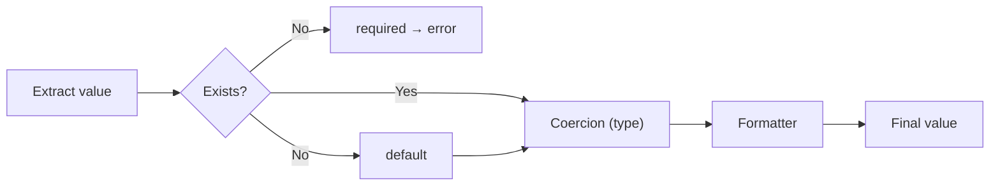

# Declarative Types

`ColumnSpec` accepts an optional `type` parameter that performs **automatic coercion** of the extracted values.

## Available Types

| Type | Python | Input example | Result |
|------|--------|-------------------|-----------|
| `"str"` | `str` | `42` | `"42"` |
| `"int"` | `int` | `"7"` | `7` |
| `"float"` | `float` | `"3.14"` | `3.14` |
| `"bool"` | `bool` | `"true"` / `"yes"` | `True` |
| `"date"` | `datetime.date` | `"2025-06-15"` | `date(2025, 6, 15)` |
| `"datetime"` | `datetime.datetime` | `"2025-06-15T10:30:00"` | `datetime(...)` |

## Basic Usage

```python
from pyreps import ColumnSpec, ReportSpec

spec = ReportSpec(
    output_format="csv",
    columns=[
        ColumnSpec(label="ID", source="id", type="int"),
        ColumnSpec(label="Active", source="active", type="bool"),
        ColumnSpec(label="Created at", source="created_at", type="date"),
    ],
)
```

!!! tip "Optional and backward compatible"
    `type=None` (default) keeps the value exactly as it came from the source — zero friction for those who don't need it.

## Execution Order

The processing pipeline for each field follows this order:



1. **Extraction** via dot notation (`source`)
2. **Validation** of mandatory fields (`required`)
3. **Default** for missing fields
4. **Coercion** to the declared type (`type`)
5. **Formatter** receives the already typed value

!!! example "Typed Formatter"
    ```python
    ColumnSpec(
        label="Date",
        source="created_at",
        type="date",  # coerce string → date object
        formatter=lambda d: d.strftime("%d/%m/%Y"),  # receives date, not string
    )
    ```

## Accepted Date Formats

### `date`

| Format | Example |
|---------|---------|
| ISO 8601 | `2025-06-15` |
| BR | `15/06/2025` |
| US | `06/15/2025` |
| `datetime` object | Extracts `.date()` |

### `datetime`

| Format | Example |
|---------|---------|
| ISO 8601 | `2025-06-15T10:30:00` |
| Space | `2025-06-15 10:30:00` |
| BR | `15/06/2025 10:30:00` |
| `date` object | Converts to `datetime` at midnight |

## Bool — Accepted Values

Boolean coercion accepts strings in both **pt-BR and en-US**:

=== "Truthy"

    `"true"`, `"1"`, `"yes"`, `"sim"`, `"on"`

=== "Falsy"

    `"false"`, `"0"`, `"no"`, `"não"`, `"nao"`, `"off"`

`int` and `float` values follow standard Python rules (`0` → `False`, anything else → `True`).

## Coercion Errors

If the conversion fails, a `MappingError` is raised with context:

```
MappingError: cannot coerce field 'total' value 'abc' to type 'int' in record index 3
```

!!! note "None passes through"
    `None` values are never coerced — they pass through as `None` regardless of the declared type.
