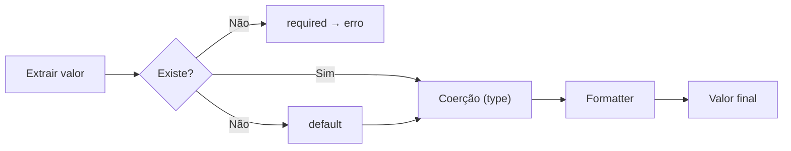

# Tipos Declarativos

O `ColumnSpec` aceita um parâmetro `type` opcional que realiza **coerção automática** dos valores extraídos.

## Tipos Disponíveis

| Tipo | Python | Exemplo de entrada | Resultado |
|------|--------|-------------------|-----------|
| `"str"` | `str` | `42` | `"42"` |
| `"int"` | `int` | `"7"` | `7` |
| `"float"` | `float` | `"3.14"` | `3.14` |
| `"bool"` | `bool` | `"true"` / `"sim"` | `True` |
| `"date"` | `datetime.date` | `"2025-06-15"` | `date(2025, 6, 15)` |
| `"datetime"` | `datetime.datetime` | `"2025-06-15T10:30:00"` | `datetime(...)` |

## Uso Básico

```python
from py_reports import ColumnSpec, ReportSpec

spec = ReportSpec(
    output_format="csv",
    columns=[
        ColumnSpec(label="ID", source="id", type="int"),
        ColumnSpec(label="Ativo", source="active", type="bool"),
        ColumnSpec(label="Criado em", source="created_at", type="date"),
    ],
)
```

!!! tip "Opcional e retrocompatível"
    `type=None` (padrão) mantém o valor como veio da fonte — zero atrito para quem não precisa.

## Ordem de Execução

O pipeline de processamento de cada campo segue esta ordem:



1. **Extração** via dot notation (`source`)
2. **Validação** de campos obrigatórios (`required`)
3. **Default** para campos ausentes
4. **Coerção** para o tipo declarado (`type`)
5. **Formatter** recebe o valor já tipado

!!! example "Formatter com tipo"
    ```python
    ColumnSpec(
        label="Data",
        source="created_at",
        type="date",  # coerce string → date object
        formatter=lambda d: d.strftime("%d/%m/%Y"),  # recebe date, não string
    )
    ```

## Formatos de Data Aceitos

### `date`

| Formato | Exemplo |
|---------|---------|
| ISO 8601 | `2025-06-15` |
| BR | `15/06/2025` |
| US | `06/15/2025` |
| `datetime` objeto | Extrai `.date()` |

### `datetime`

| Formato | Exemplo |
|---------|---------|
| ISO 8601 | `2025-06-15T10:30:00` |
| Espaço | `2025-06-15 10:30:00` |
| BR | `15/06/2025 10:30:00` |
| `date` objeto | Converte para `datetime` à meia-noite |

## Bool — Valores Aceitos

A coerção de bool aceita strings em **pt-BR e en-US**:

=== "Truthy"

    `"true"`, `"1"`, `"yes"`, `"sim"`, `"on"`

=== "Falsy"

    `"false"`, `"0"`, `"no"`, `"não"`, `"nao"`, `"off"`

Valores `int` e `float` seguem a regra padrão do Python (`0` → `False`, qualquer outro → `True`).

## Erros de Coerção

Se a conversão falhar, um `MappingError` é levantado com contexto:

```
MappingError: cannot coerce field 'total' value 'abc' to type 'int' in record index 3
```

!!! note "None passa direto"
    Valores `None` nunca são coercidos — passam como `None` independente do tipo declarado.
