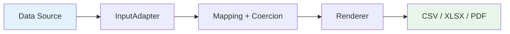

---
hide:
  - navigation
---

!!! info "🇧🇷 Português Brasileiro"
    Nós temos um [resumo completo e guia de início rápido em Português Brasileiro](pt-br.md) disponível!

# {{ project_name }}

<p align="center" style="font-size: 1.25em;">
  Python report generation — CSV, XLSX, and PDF with Rust performance. :zap:
</p>

---

<div class="grid cards" markdown>

-   :material-lightning-bolt:{ .lg .middle } **High Performance**

    ---

    Streaming pipeline with constant memory. XLSX via Rust, JSON via orjson.
    500K rows using **< 1 MB** of RAM.

-   :material-puzzle:{ .lg .middle } **Easy Integration**

    ---

    Supports `list[dict]`, JSON, SQL. Optional declarative types.
    Ready for Django, FastAPI, Celery.

-   :material-file-multiple:{ .lg .middle } **3 Formats**

    ---

    CSV, XLSX, and PDF with a single API. Switch formats by
    changing a parameter.

-   :material-scale-balance:{ .lg .middle } **Lightweight & No Bloat**

    ---

    3 runtime dependencies. No pandas, no numpy.
    Install and use in seconds.

</div>

---

## Installation

```bash
pip install {{ project_name }}
```

Or with **uv**:

```bash
uv add {{ project_name }}
```

## Quickstart

```python
from {{ project_name }} import ColumnSpec, ReportSpec, generate_report

# data sample
data = [
    {"id": 1, "customer": {"name": "Ana"}, "total": 100.50},
    {"id": 2, "customer": {"name": "Bruno"}, "total": 250.00},
]

spec = ReportSpec(
    output_format="csv",  # or "xlsx" or "pdf"
    columns=[
        ColumnSpec(label="ID", source="id", type="int"),
        ColumnSpec(label="Customer", source="customer.name"),
        ColumnSpec(label="Total", source="total", type="float",
                   formatter=lambda v: f"$ {v:.2f}"),
    ],
)

generate_report(data_source=data, spec=spec, destination="sales.csv")
```

!!! tip "Next step"
    Check the [Quickstart](guide/quickstart.md) for full examples for each format.

## Architecture



The pipeline is **100% streaming** for CSV and XLSX — each record is processed and discarded without accumulating in memory. PDF uses chunked streaming (O(chunk_size)); see [Performance](guide/performance.md) for details.

## Links

- :fontawesome-brands-github: [Source code]({{ repo_url }})
- :fontawesome-brands-python: [PyPI]({{ pypi_url }})
- :material-bug: [Issues]({{ repo_url }}/issues)
