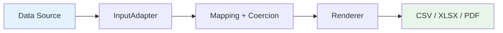

---
hide:
  - navigation
---

# pyreps

<p align="center" style="font-size: 1.25em;">
  Geração de relatórios em Python — CSV, XLSX e PDF com performance de Rust. :zap:
</p>

---

<div class="grid cards" markdown>

-   :material-lightning-bolt:{ .lg .middle } **Alta Performance**

    ---

    Pipeline streaming com memória constante. XLSX via Rust, JSON via orjson.
    500K linhas usando **< 1 MB** de RAM.

-   :material-puzzle:{ .lg .middle } **Fácil Integração**

    ---

    Aceita `list[dict]`, JSON, SQL. Tipos declarativos opcionais.
    Pronto para Django, FastAPI, Celery.

-   :material-file-multiple:{ .lg .middle } **3 Formatos**

    ---

    CSV, XLSX e PDF com uma única API. Troque o formato
    alterando um parâmetro.

-   :material-scale-balance:{ .lg .middle } **Leve & Sem Bloat**

    ---

    3 dependências de runtime. Sem pandas, sem numpy.
    Instale e use em segundos.

</div>

---

## Instalação

```bash
pip install pyreps
```

Ou com **uv**:

```bash
uv add pyreps
```

## Exemplo Rápido

```python
from pyreps import ColumnSpec, ReportSpec, generate_report

data = [
    {"id": 1, "cliente": {"nome": "Ana"}, "total": 100.50},
    {"id": 2, "cliente": {"nome": "Bruno"}, "total": 250.00},
]

spec = ReportSpec(
    output_format="csv",  # ou "xlsx" ou "pdf"
    columns=[
        ColumnSpec(label="ID", source="id", type="int"),
        ColumnSpec(label="Cliente", source="cliente.nome"),
        ColumnSpec(label="Total", source="total", type="float",
                   formatter=lambda v: f"R$ {v:.2f}"),
    ],
)

generate_report(data_source=data, spec=spec, destination="vendas.csv")
```

!!! tip "Próximo passo"
    Veja o [Início Rápido](guide/quickstart.md) para exemplos completos de cada formato.

## Arquitetura



O pipeline é **100% streaming** para CSV e XLSX — cada registro é processado e descartado sem acumular em memória. O PDF usa streaming por chunks (O(chunk_size)), veja [Performance](guide/performance.md) para detalhes.

## Links

- :fontawesome-brands-github: [Código fonte](https://github.com/jhonatan/pyreps)
- :fontawesome-brands-python: [PyPI](https://pypi.org/project/pyreps/)
- :material-bug: [Issues](https://github.com/jhonatan/pyreps/issues)
